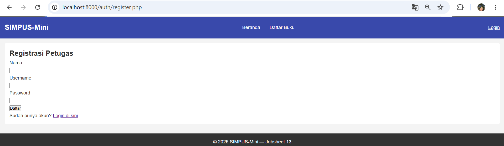
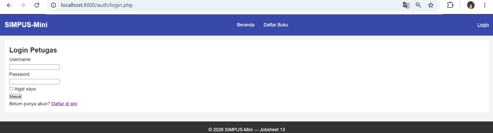
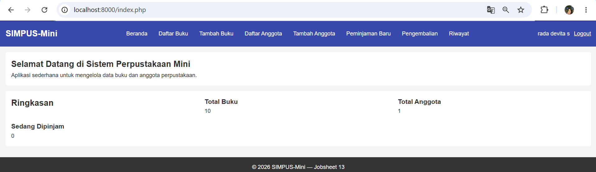
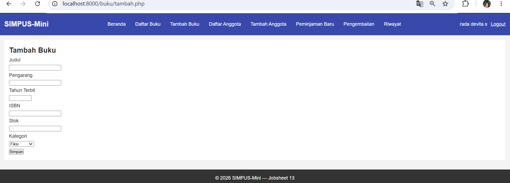
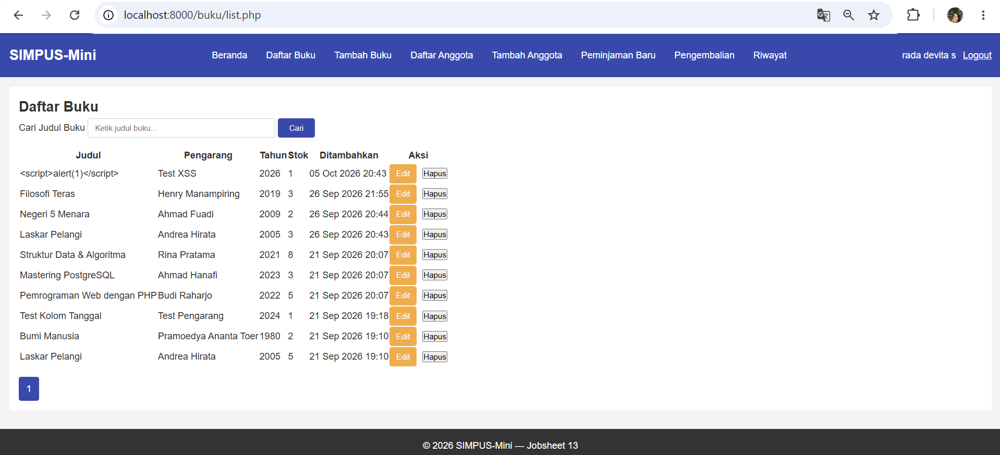
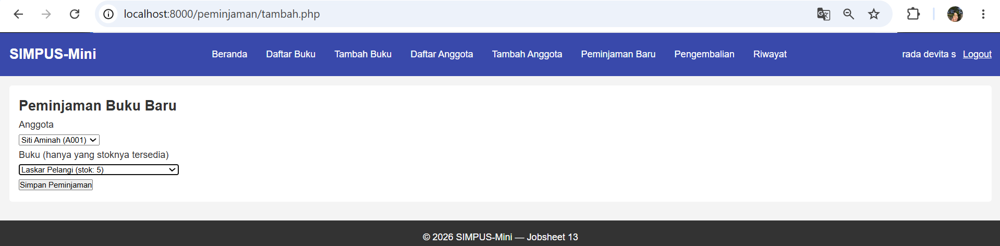
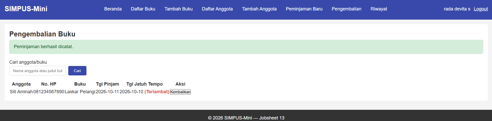
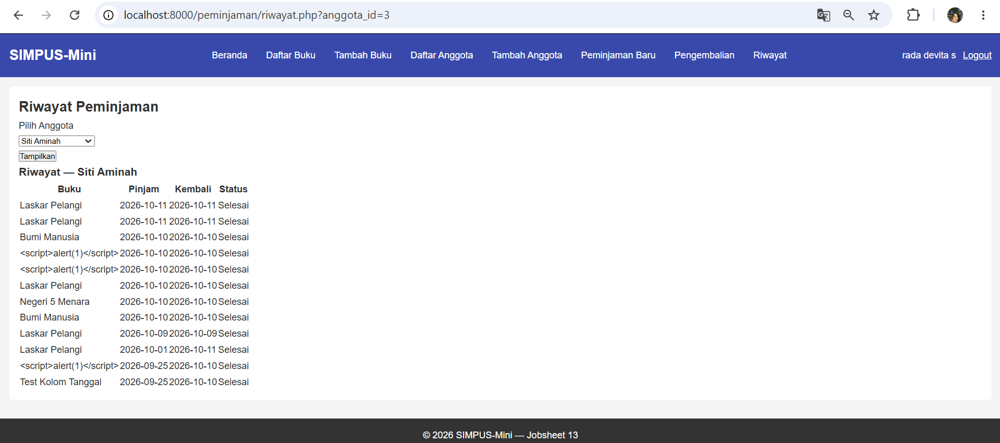

# Manual Pengguna — SIMPUS-Mini

Panduan ini ditujukan untuk petugas perpustakaan. Alamat contoh memakai
`http://localhost:8000/...` (sesuaikan dengan alamat server yang dipakai).

## 1. Registrasi & Login Petugas

1. Buka `http://localhost:8000/auth/register.php`.
2. Isi Nama, Username, Password (minimal 6 karakter), klik **Daftar**.

   

3. Setelah berhasil, Anda diarahkan ke halaman Login. Masukkan username dan password, klik **Masuk**. Centang **Ingat saya** bila ingin tetap login.

   

4. Setelah login, navbar menampilkan nama petugas, tombol **Logout**, dan menu tambahan (Tambah Buku, Daftar/Tambah Anggota, Peminjaman Baru, Pengembalian, Riwayat) yang tidak terlihat oleh Tamu.

   

## 2. Mengelola Data Buku

1. Klik menu **Tambah Buku**, isi Judul, Pengarang, Tahun, ISBN, Stok, Kategori, klik **Simpan**.

   

2. Buku baru tampil di **Daftar Buku**. Gunakan kolom pencarian untuk menyaring berdasarkan judul.

   

3. Klik **Edit** untuk mengubah data, atau **Hapus** untuk menghapus (akan muncul konfirmasi).

## 3. Mengelola Data Anggota

Alurnya sama dengan Buku: menu **Tambah Anggota** → isi form → tampil di **Daftar Anggota** → Edit/Hapus tersedia per baris.

## 4. Meminjamkan Buku

1. Klik menu **Peminjaman Baru**.
2. Pilih **Anggota** dan **Buku** (hanya buku dengan stok tersedia yang muncul), klik **Simpan Peminjaman**.

   

3. Tanggal jatuh tempo otomatis 14 hari setelah tanggal pinjam. Anggota yang masih memiliki peminjaman lebih dari 14 hari belum dikembalikan tidak dapat meminjam lagi.
4. Di **Beranda**, kartu "Sedang Dipinjam" bertambah, dan stok buku di **Daftar Buku** berkurang 1.

## 5. Mengembalikan Buku

1. Klik menu **Pengembalian**.
2. Cari transaksi berdasarkan nama anggota atau judul buku (opsional). Transaksi yang melewati jatuh tempo diberi label merah **(Terlambat)**, dan nomor HP anggota ditampilkan untuk menghubunginya. Klik **Kembalikan** pada baris yang sesuai.

   

3. Stok buku bertambah 1 dan transaksi hilang dari daftar aktif.

## 6. Melihat Riwayat Peminjaman

1. Klik menu **Riwayat**.
2. Pilih nama anggota dari dropdown, klik **Tampilkan**.
3. Tabel menampilkan seluruh riwayat beserta status (Dipinjam/Selesai).

   

## 7. Logout

Klik **Logout** di navbar kanan atas. Setelah logout, menu petugas hilang dan halaman yang butuh login otomatis mengarah ke halaman Login.